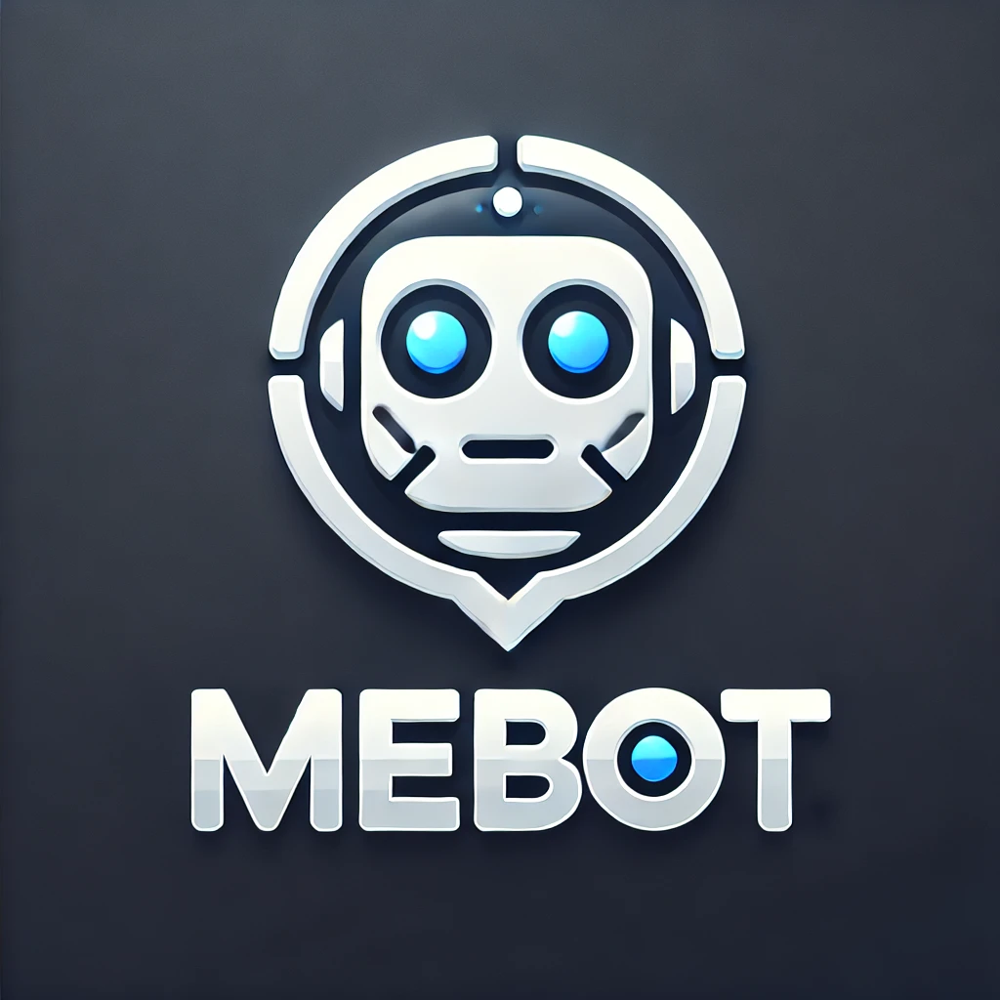
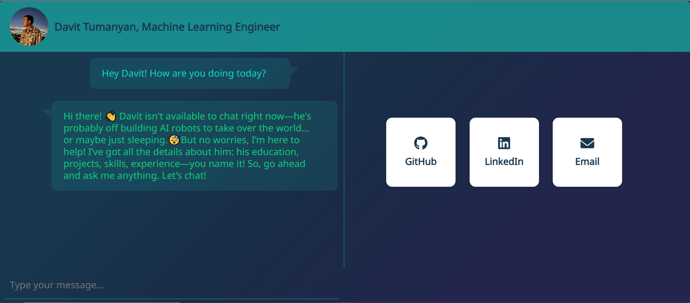

# MeBot - My AI Clone Chatbot


Welcome to **MeBot**, an AI chatbot designed to act as my digital "clone". Users can ask MeBot questions, have conversations, and learn a lot of information about my background, interests, and expertise.


---

## Table of Contents

1. [Overview](#overview)
2. [Features](#features)
3. [Requirements](#requirements)
4. [Installation Instructions](#installation-instructions)
5. [Running the Application](#running-the-application)
6. [Environment Variables](#environment-variables)
7. [Troubleshooting](#troubleshooting)
8. [Contribution](#contribution)
9. [License](#license)

---

## Overview

**MeBot** is a chatbot built using FastAPI and Docker to provide fast and interactive responses using OpenAI's GPT API. It is simple to run locally and requires no modifications or customizations to the code.

---

## Features

- **MeBot**: Engages in conversations as my digital representation.
- **FastAPI Integration**: Lightning-fast API responses.
- **Dockerized Setup**: Seamless containerization with Docker.
- **Simple to Run**: Just run the `.bat` file—no additional setup required.

---

## Requirements

Before running MeBot, ensure you have the following installed:

- **Docker Desktop** ([Download Docker](https://www.docker.com/products/docker-desktop))
- Windows OS (for `.bat` file execution)
- Internet connection (to pull the Docker image)

---

## Installation Instructions

There are two ways to run MeBot:

### Option 1: Download and Run the `.bat` File

1. Download the [`MeBotApp.bat`](https://github.com/dav00arm/MeBotApp/releases/download/latest/MeBotApp.bat) file (just right click and "save as").
2. Ensure that **Docker Desktop** is installed and running.
3. Double-click the `MeBot.bat` file.

This will automatically:
- Pull the Docker image (if not already pulled)
- Start the Docker container
- Open the FastAPI interface in your default web browser.

---

## Environment Variables

When you run the `.bat` file, you will be prompted to enter your OpenAI API key. Make sure to enter the correct key to avoid errors. 

# Tip
If you already have set your OPENAI_API_KEY environment variable, just press enter. 

---
### Option 2: Clone the Repository and Run Manually

1. Clone the repository:
   ```bash
   git clone https://github.com/dav00arm/MeBotApp.git
   cd MeBotApp
   ```
2. Install the dependencies:
   ```
   pip install -r requirements.txt
   ```
4. Run the application using Uvicorn:
   ```bash
   uvicorn api:app --reload
   ```

This method runs the FastAPI application directly without Docker.

---

## Troubleshooting

- **Docker Not Running**: Ensure Docker Desktop is open and running.
- **Port Issues**: Ensure port 8000 is not being used by another process.
- **API Key Errors**: Verify that your OpenAI API key is correct and has sufficient credits.

---

## Contribution

We welcome contributions! Feel free to open issues and pull requests to improve MeBot.

### How to Contribute:

1. Fork the repository.
2. Create a new branch.
3. Make your changes.
4. Submit a pull request.

---

## License

This project is licensed under the MIT License.

---

Thank you for using **MeBot**! Feel free to reach out if you have any questions or need support.

---

**Contact:** [davtumanyan03@gmail.com](mailto:davtumanyan03@gmail.com) or open an issue on the repository.

